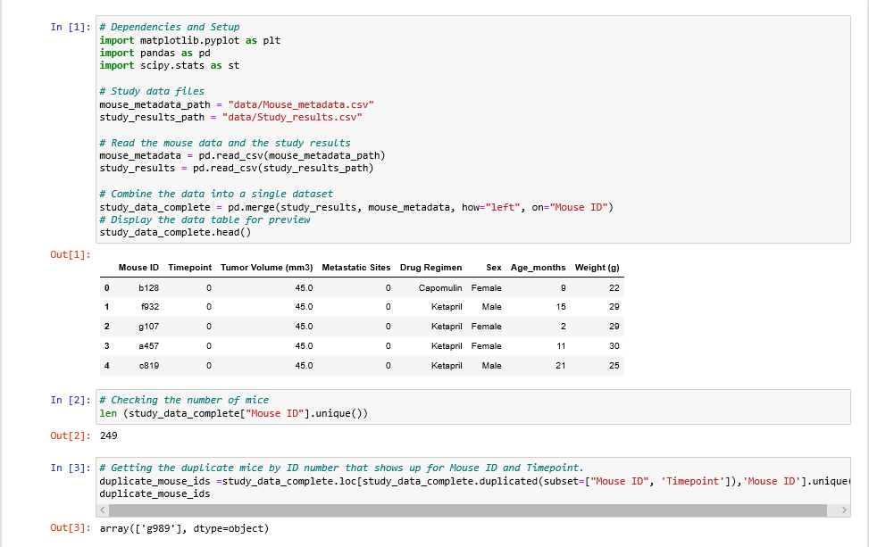
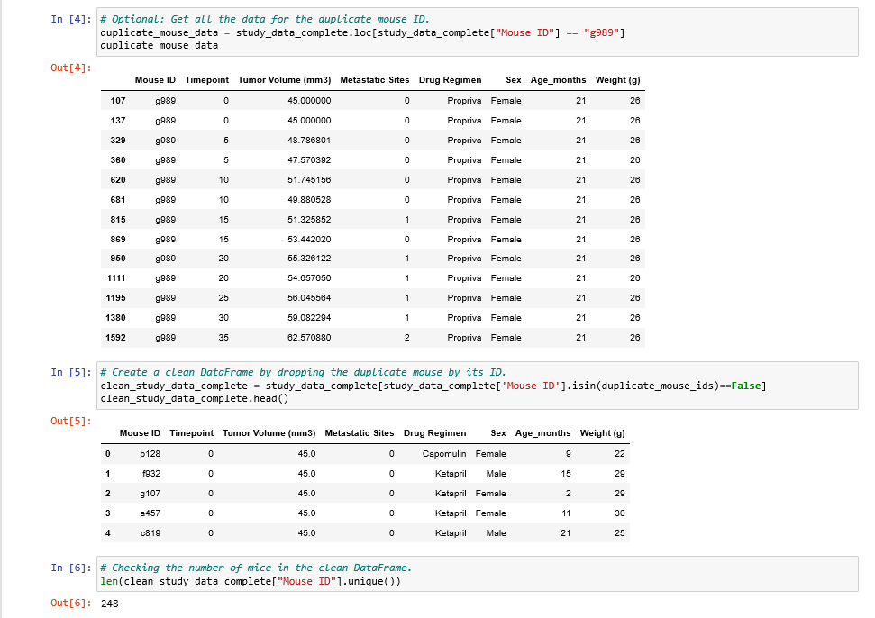
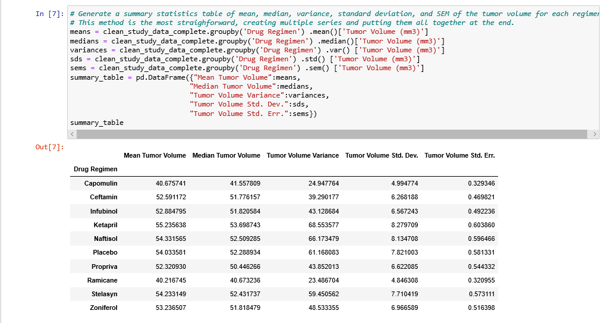
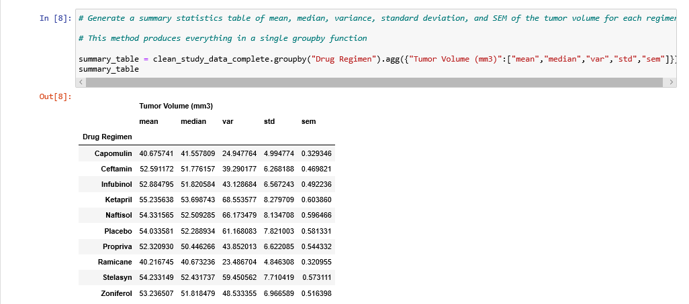
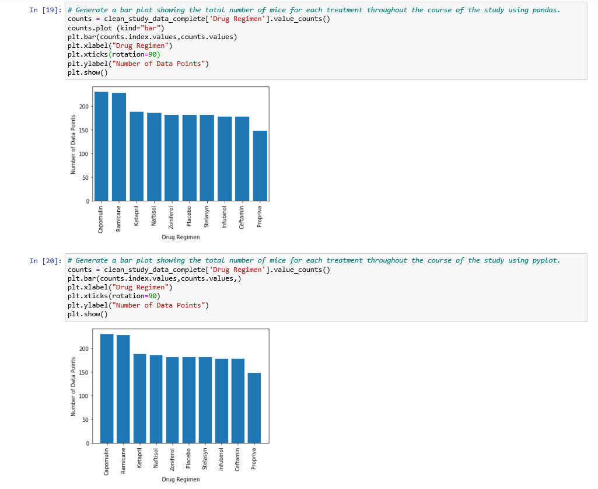
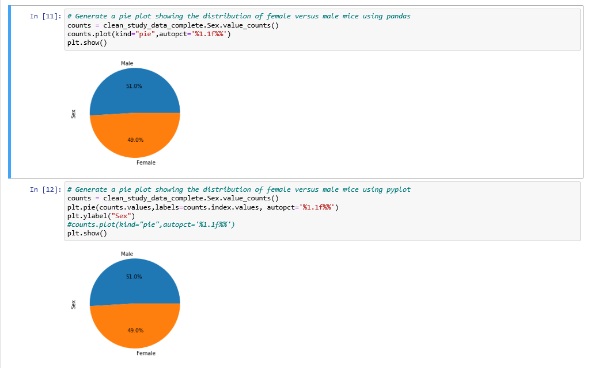
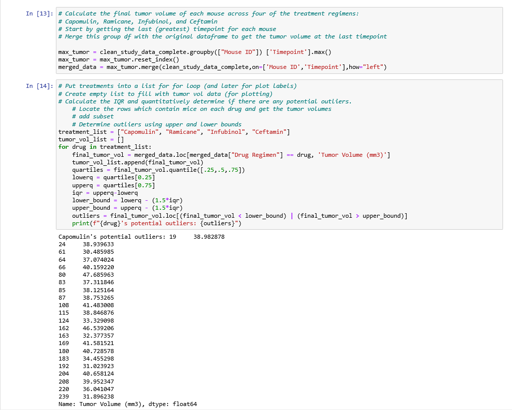
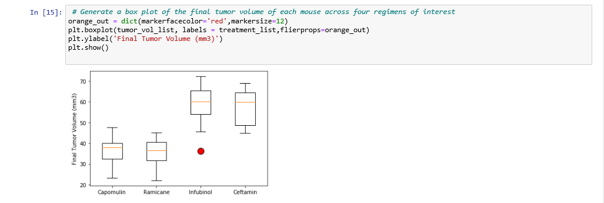
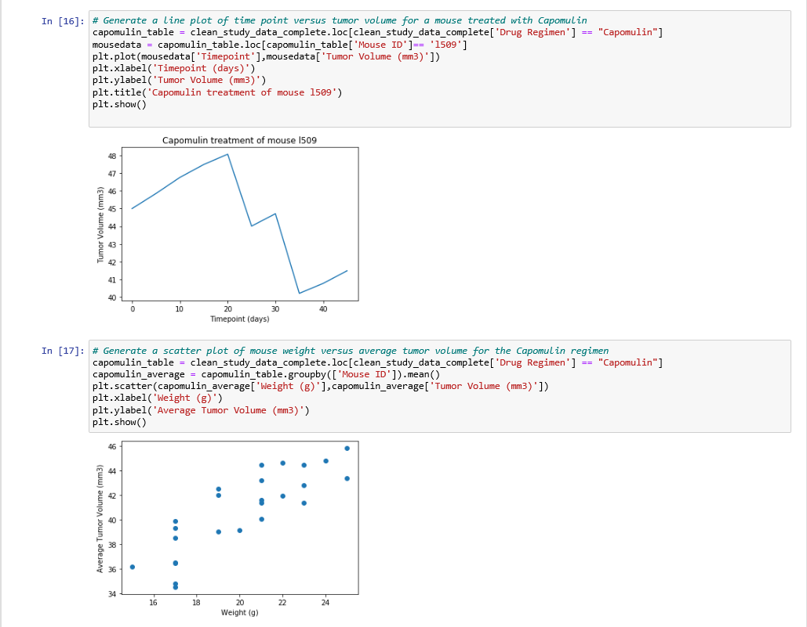
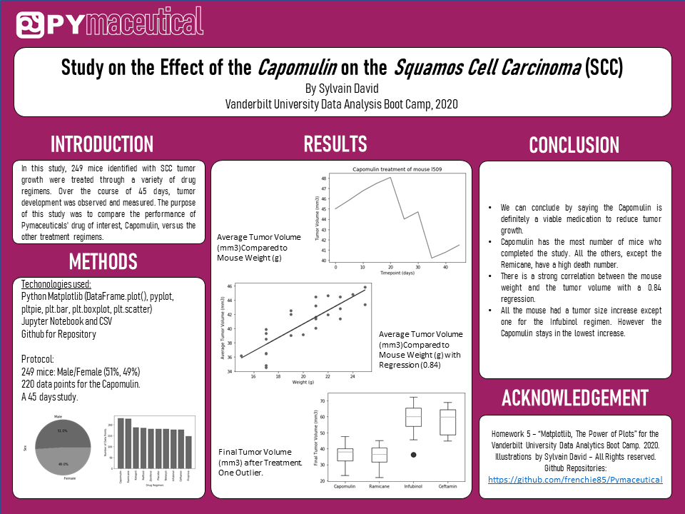

# Pymaceutical - Matplotlib

## Table of Content ##
*Overview,*
*Pymaceutical Report (code),*
*Pymaceutical Graphs,*
*Three Observable Trends,*
*Infographic,*
*Technologies used.*

## Overview ##
*Capomulin Medication*
Pymaceuticals specializes in anti-cancer pharmaceuticals. In its most recent efforts, it began screening for potential treatments for squamous cell carcinoma (SCC), a commonly occurring form of skin cancer.
As a senior data analyst at the company, you've been given access to the complete data from their most recent animal study. In this study, 249 mice identified with SCC tumor growth were treated through a variety of drug regimens. Over the course of 45 days, tumor development was observed and measured. The purpose of this study was to compare the performance of Pymaceuticals' drug of interest, Capomulin, versus the other treatment regimens. You have been tasked by the executive team to generate all of the tables and figures needed for the technical report of the study. The executive team also has asked for a top-level summary of the study results.

## Pymaceutical Report##

# Observations and Insights #

# Summary Statistics #

# Bar and Pie Charts #

# Quartiles, Outliers and Boxplots #

# Line and Scatter Plots #

# Correlation and Regression #

## Pymaceutical Graphs ##
* Bar and Pie charts

* 

* Quartiles, Outliers and Boxplots

* Line and scatter plots

* 

* Correlation and regression

## Three Observable Trends ##

When we analyze the data on the medication *Capomulin*, we can observe three trends based on 248 mice over a study period of 45 days.
We can say the Capomulin is definitely a viable medication to reduce tumor growth
Capomulin has the most number of mice who completed the study. All the others, except the Remicane, have a high death number.
There is a strong correlation between the mouse weight and the tumor volume with a 0.84 regression.
All the mouse had a tumor size increase except one for the Infubinol regimen. However the Capomulin stays in the lowest increase. 

## Infographics ##
* Scientific Poster
  

* Summary
  

## Technologies used ##
* Pandas Library: DataFrame.plot()
* Jupyter Notebook
* Adobe Illustrator
* .cvs files
  
## Authors ##
* Sylvain David - Data Analytics Bootcamp - Vanderbilt University - 2020
* Illustrations by Sylvain David - All Rights Reserved - 2020